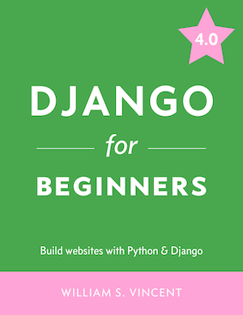

The official source code for [https://djangoforbeginners.com/](https://djangoforbeginners.com/). Available as an [ebook](https://gum.co/aFiMm) or in [Paperback](https://www.amazon.com/dp/1983172669/?tag=wsvincent-20).

Have a different version of the book?

- [3.2 version repo](https://github.com/wsvincent/djangoforbeginners_32)
- [3.1 version repo](https://github.com/wsvincent/djangoforbeginners_31)
- [3.0 version repo](https://github.com/wsvincent/djangoforbeginners_30)

1. Clone this repo
2. Delete the .git folder
  rm -rf .git/
3. Create a new git repo
  git init
  git add .
  git commit -m "Initial Commit"
4. Install Python dependencies in a Python3 virtual environment
  pipenv install --three
